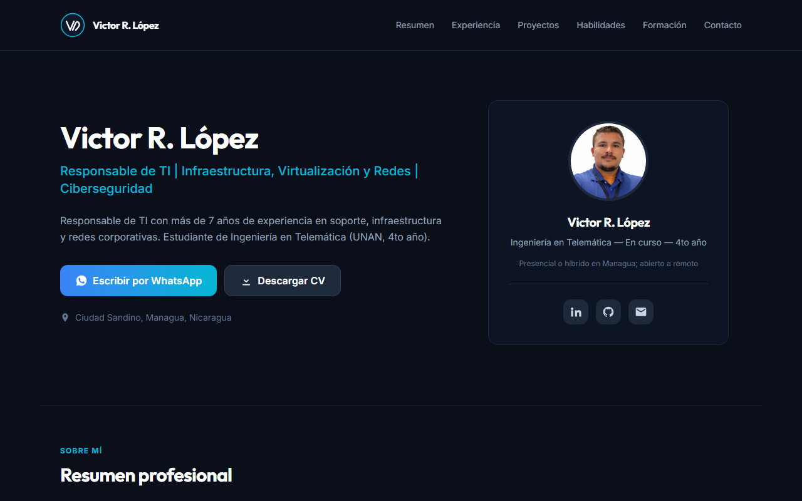

# Documentación técnica

Este repositorio contiene el perfil profesional de Victor R. López: la web de
[victorlpz3293.me](https://www.victorlpz3293.me), el CV en PDF y el README del perfil de GitHub.

Todo el texto sobre Victor sale de [`data/profile.json`](../data/profile.json). Nada se escribe a
mano en dos sitios: la web, el PDF, el README y el asistente se generan o leen desde ese archivo.



<sub>Captura del sitio, generada con `npm run preview`.</sub>

## Qué es público y qué no

Este repositorio es público, y `data/profile.json` con él. Solo contiene información publicable.

El material editorial vive en `_privado/`, que está en `.gitignore` y nunca se sube:

| Archivo | Contiene |
|---|---|
| `_privado/notas.json` | Proyectos excluidos y sus motivos, formación no relacionada con TI, notas por proyecto, restricciones de redacción de NITSC, notas editoriales y las URL de los repositorios privados |
| `_privado/observaciones.md` | Hallazgos sobre repositorios privados |
| `_privado/LINKEDIN.md` | Cambios pendientes en el perfil de LinkedIn |

Algunos términos prohibidos son nombres de proyectos privados, así que no pueden escribirse ni en
`profile.json` ni en el verificador. De esos se guarda solo la huella SHA-256 del término
normalizado, en `prohibido_privado[]`. El verificador trocea cada salida en palabras y grupos de
dos, calcula la huella y la compara. El nombre nunca figura escrito en el repositorio y la
comprobación sigue funcionando en un checkout público, donde `_privado/` no existe.

No es un secreto criptográfico: sin sal, un ataque de diccionario daría con la palabra. El objetivo
es que el nombre no figure en el repositorio, no volverlo irrecuperable.

Como consecuencia de la separación, **`npm run validate` no puede cruzar los proyectos visibles
contra la lista de excluidos cuando `_privado/notas.json` no está** — es decir, en el build de
Vercel y en GitHub Actions. En esos entornos lo avisa por consola en vez de callar. El cruce sí se
hace en local, que es donde se edita el JSON.

---

## Cómo se genera cada cosa

| Salida | Se genera con | Se versiona |
|---|---|---|
| `api/_contexto.generado.js` | `scripts/build-context.mjs` | No |
| `public/js/cerebro-local.generado.js` | `scripts/build-context.mjs` | No |
| `public/js/contacto.generado.js` | `scripts/build-context.mjs` | No |
| `public/index.html` | `scripts/build-site.mjs` | No |
| `public/css/estilo.css` | Tailwind CLI v3 | No |
| `public/assets/perfil.webp` y `og-victor-lopez.jpg` | `scripts/optimize-assets.mjs` | Sí |
| `public/assets/fonts/*.woff2` | `scripts/fetch-fonts.mjs` | Sí |
| `public/assets/preview.png` | `scripts/capture-preview.mjs` | Sí |
| `public/cv-victor-lopez.pdf` | `scripts/build-pdf.mjs` | No |
| `README.md` | `scripts/build-readme.mjs` | Sí |

Los archivos con sufijo `.generado.js` y `public/index.html` **no se editan a mano**: el siguiente
build los sobrescribe. Para cambiar su contenido se edita `data/profile.json` o la plantilla.

### Dónde se ejecuta la generación

**En el build de Vercel.** El *Build Command* del proyecto es `npm run build`, que encadena:

```
validate  →  build:context  →  build:css  →  build:pdf  →  build:site  →  check-claims
```

`build:pdf` va antes de `build:site`, que solo muestra el botón de descarga si el PDF existe, y
antes de `check-claims`, que revisa el texto extraído del PDF.

Se hace así, y no en un commit previo, por tres razones:

1. **Nunca se despliega con datos viejos.** Cada despliegue regenera desde el `profile.json` de ese
   commit; es imposible publicar un `index.html` que no corresponda a los datos.
2. **Nunca falta un archivo.** Los `.generado.js` están en `.gitignore`, así que no pueden quedar
   desincronizados ni provocar conflictos de merge. Si el build no corre, no hay despliegue.
3. **`check-claims` corre al final, sobre lo que realmente se va a publicar.** Si aparece una
   afirmación prohibida, el build falla y el despliegue no ocurre.

El README es la excepción: sí se versiona, porque GitHub lo lee directamente del repositorio para
mostrarlo en el perfil. Lo regenera el workflow de GitHub Actions. Enlaza el PDF por su URL en el
sitio, no por una ruta del repositorio.

### Trabajo local

```bash
npm install
npm run build        # valida, genera todo y revisa las afirmaciones
npm run validate     # solo valida data/profile.json
npm run check-claims # solo revisa las salidas ya generadas
npm run assets       # regenera las imágenes desde assets/origen/
```

`npm run assets` no forma parte de `npm run build`: la foto cambia muy de vez en cuando, y dejarlo
fuera evita que cada despliegue tenga que compilar `sharp`. Sus salidas sí se versionan. Hay que
ejecutarlo a mano cuando cambie `assets/origen/perfil.png`.

```bash
npm run fonts        # vuelve a descargar las fuentes (rara vez hace falta)
npm run build:pdf    # regenera el CV en PDF; necesita Playwright
npm run build:readme # regenera el README.md raíz
npm run preview      # recaptura public/assets/preview.png del sitio ya generado
```

### Fuentes

Inter y Outfit se sirven desde `/assets/fonts/`, no desde Google Fonts. Se piden como rango de
pesos (`400..700`), de modo que Google devuelve la fuente **variable**: un solo archivo por familia
cubre todos los pesos. Solo se descarga el subconjunto **latino**, suficiente para el español.

Son 78.7 KB entre las dos. A cambio, la página no hace ninguna petición a terceros y la CSP puede
declarar `style-src 'self'` y `font-src 'self'`.

### El CV en PDF

`npm run build:pdf` genera `public/cv-victor-lopez.pdf` con Playwright, desde
`templates/cv-print.mjs`. Ningún PDF se versiona: este lo produce cada build.

- Una sola columna, sin imágenes ni iconos y con encabezados corrientes, para que un lector
  automático de currículums extraiga el texto sin perderse.
- Fondo claro a propósito: el PDF se imprime. Del sitio conserva los colores de acento.
- Del JSON toma la experiencia completa, tres proyectos, las habilidades de producción (más una
  línea de laboratorio, otra de desarrollo asistido por IA y otra de lo estudiado sin experiencia
  laboral), educación, formación destacada e idiomas. Los cuatro tipos de evidencia son los mismos
  que muestra la web.
- **El script falla si el resultado pasa de dos páginas.** Cuenta las páginas en el propio PDF, así
  que el límite no depende de que nadie se acuerde de comprobarlo.
- Deja `build/cv-texto.txt` con el texto extraído del documento, que es lo que revisa
  `check-claims`: se verifica lo que el PDF dice, no lo que dice su plantilla.

Los márgenes se declaran **solo** en la llamada a `pdf()`, no en el `@page` del CSS. Si estuvieran
en los dos sitios, Chromium los sumaría y el contenido no cabría en dos páginas.

**Por qué no se versiona.** Chromium no genera el mismo PDF dos veces: incrusta la fecha de
creación y un identificador de documento. Mientras se versionaba, cada ejecución del workflow
confirmaba un PDF "nuevo" aunque `profile.json` no hubiera cambiado. Ahora lo genera cada build,
igual que `index.html`, y nunca puede quedar desincronizado con los datos.

**Chromium en Vercel.** La imagen de build de Vercel es Amazon Linux 2023, y ahí el Chromium de
Playwright no arranca: le faltan librerías del sistema (`libnss3`, `libnspr4`, `libgbm`, las de
X11, entre otras). Se comprobó reproduciendo el build en el contenedor `amazonlinux:2023`, que es
lo que la documentación de Vercel recomienda para simular su entorno. Por eso `vercel.json` define
su propio `installCommand`: instala esas librerías con `dnf`, luego las dependencias con `npm ci`
y después solo el `chromium-headless-shell` de Playwright. Si alguna vez el build de Vercel falla
con `error while loading shared libraries`, falta una librería en esa lista.

Si el PDF no se puede generar, el build falla y el despliegue no ocurre: Vercel sigue sirviendo la
versión anterior, con su PDF. Es preferible a publicar un sitio sin CV.

Para levantar el sitio y el asistente en local hace falta la CLI de Vercel, porque `/api/chat-cv`
es una función serverless:

```bash
cp .env.example .env.local   # y poner la GEMINI_API_KEY real
npx vercel dev
```

---

## El asistente

Un chat en el sitio responde preguntas sobre el perfil. Está en
[`api/chat-cv.js`](../api/chat-cv.js) (función serverless) y
[`public/js/chat.js`](../public/js/chat.js) (interfaz).

### Cómo funciona

- El contexto se construye **en el servidor** desde `data/profile.json`, en tiempo de build. El
  navegador solo envía la pregunta del visitante. Si la petición incluye un campo `context`, se
  ignora.
- La instrucción de sistema obliga a responder únicamente con datos del contexto. Ante cualquier
  cosa que no esté ahí responde *"No tengo esa información; puedes escribirle a Victor"* y da el
  correo.
- El contexto separa de forma explícita lo hecho **en producción**, lo hecho **en laboratorio** y lo
  **solo estudiado**, para que el modelo no pueda presentar una cosa como la otra.
- Tras **3 intercambios** el campo de texto se cierra y quedan dos botones: WhatsApp y correo. No se
  abre ninguna pestaña automáticamente y el historial de la conversación no se envía a WhatsApp.
- Si la API no responde, contesta el respaldo local (`cerebro-local.generado.js`), también generado
  desde el JSON. La respuesta se marca como sin conexión.

### Medidas de seguridad

| Medida | Dónde |
|---|---|
| El contexto nunca viene del cliente | `api/chat-cv.js` |
| Se exige cabecera `Origin` válida; sin ella, 403 | `api/chat-cv.js` |
| Pregunta limitada a 400 caracteres | `api/chat-cv.js` y `public/js/chat.js` |
| Respuesta limitada a 300 tokens | `api/chat-cv.js` |
| Salida renderizada con `textContent`, nunca `innerHTML` | `public/js/chat.js` |
| Límite de peticiones por IP | Vercel Firewall (ver abajo) |
| La API key solo existe como variable de entorno | Vercel |

### Orígenes permitidos

Según `VERCEL_ENV`:

- **production** — `https://victorlpz3293.me` y `https://www.victorlpz3293.me`.
- **preview** — los anteriores más `https://$VERCEL_URL` y `https://$VERCEL_BRANCH_URL`. Vercel
  define esas dos variables en el servidor, así que el cliente no puede manipularlas.
- **desarrollo** — los de producción más `http://localhost:3000` y `http://127.0.0.1:3000`.

### Límite de peticiones (Vercel Firewall)

No vive en el repositorio. Se configura en el panel de Vercel, en *Firewall → Rules*:

| Campo | Valor |
|---|---|
| Ruta | `/api/chat-cv` |
| Límite | 20 peticiones |
| Ventana | 10 minutos |
| Agrupado por | Dirección IP |
| Acción | *Deny* |

Un visitante legítimo nunca se acerca al límite: la conversación se cierra a los 3 intercambios.
El umbral está pensado contra scripts automatizados, no contra personas.

### Variables de entorno

| Variable | Obligatoria | Para qué |
|---|---|---|
| `GEMINI_API_KEY` | Sí | Autenticación contra la API de Gemini |
| `GEMINI_MODEL` | No | Modelo a usar. Por defecto `gemini-2.5-flash-lite` |

`VERCEL_ENV`, `VERCEL_URL` y `VERCEL_BRANCH_URL` las define Vercel automáticamente.

---

## Barreras de calidad

### `npm run validate`

Valida `data/profile.json` contra `data/profile.schema.json` (JSON Schema 2020-12) y añade
comprobaciones que un schema no puede expresar:

- Fechas coherentes (`desde` nunca posterior a `hasta`).
- Un solo puesto sin fecha de fin. Atrapa el error de registrar NITSC como empleo concurrente.
- Sin identificadores duplicados en experiencia ni en proyectos.
- Ningún proyecto visible que esté también en `proyectos_excluidos`.
- Todo proyecto visible declara `desarrollo` o `evidencia`.
- El titular no dice "Ingeniero" mientras la carrera figure en curso.

### `npm run check-claims`

Busca en las salidas generadas las afirmaciones de `prohibido[]` y falla el build si aparece alguna.

Como `prohibido[]` está escrito en lenguaje natural ("Cualquier porcentaje de uptime"), no se puede
buscar por texto literal: cada entrada tiene una regla con patrones concretos en
`scripts/check-claims.mjs`. Algunas llevan excepciones, para no castigar lo legítimo — "Bootcamp
Analista SOC Nivel 1" es formación real, mientras que "Analista SOC" como cargo no lo es.

Dos guardas mantienen el JSON al mando: si se agrega una entrada a `prohibido[]` sin su regla, el
script falla; y si queda una regla cuya entrada ya no existe en el JSON, también falla.

Sobre HTML analiza solo el texto visible: descarta `<script>`, `<style>`, comentarios y atributos,
de modo que una medida de anchura en CSS no se confunda con una afirmación. Sobre Markdown analiza
además la forma decodificada de cada línea, porque las insignias esconden el texto dentro de la URL.

---

## Integración continua

**Vercel despliega todo lo que llegue a `main`, pase o no pase la verificación.** Por eso la
verificación no puede ocurrir después del merge: `main` está protegida y solo se toca por Pull
Request, con el workflow en verde.

### El workflow

[`.github/workflows/verificar.yml`](../.github/workflows/verificar.yml) corre **sobre los Pull
Requests hacia `main`**, nunca sobre `main` directamente. En cada ejecución:

1. Instala Chromium con sus librerías del sistema.
2. Regenera el README.
3. Ejecuta `npm run build`, **el mismo comando que Vercel**: valida `data/profile.json`, genera el
   contexto del asistente, el CSS, el PDF y la web, y termina con `check-claims` sobre todo lo
   generado, **incluido el texto extraído del PDF** y el README.
4. Si el README cambió, hace commit **en la rama del Pull Request**. El PDF no se confirma: no se
   versiona.

Nunca hace commit en `main`. Como el workflow y Vercel ejecutan el mismo build, lo que pasa en el PR
es lo que se va a desplegar. La única diferencia es cómo se instalan las librerías de Chromium:
`apt` en Ubuntu (el workflow) y `dnf` en Amazon Linux (Vercel).

Dos detalles que evitan que el workflow se muerda la cola:

- **Filtra por rutas** (`on.pull_request.paths`): solo se dispara si cambian `data/`,
  `templates/`, `scripts/`, `src/`, los assets, el JS del navegador, `package.json`,
  `vercel.json` o el propio workflow.
- **Ignora sus propios commits**: el job lleva `if: github.actor != 'github-actions[bot]'` y sus
  commits van marcados con `[skip ci]`. Sin eso, cada commit del bot dispararía otra ejecución,
  que haría otro commit, indefinidamente.

### Proteger la rama main

Esto se configura una sola vez, en GitHub. Sin ello, un push directo a `main` se desplegaría sin
pasar por ninguna comprobación.

**Settings → Branches → Add branch ruleset** (o *Add rule* si aparece la interfaz antigua):

| Opción | Valor |
|---|---|
| Branch name pattern / Target | `main` |
| Require a pull request before merging | Activado |
| Required approvals | 0 (el repositorio tiene un solo responsable) |
| Require status checks to pass before merging | Activado |
| Status checks que deben pasar | `verificar` |
| Require branches to be up to date before merging | Activado |
| Block force pushes | Activado |
| Restrict deletions | Activado |

El check `verificar` solo aparece en la lista después de que el workflow haya corrido al menos una
vez; conviene abrir un Pull Request de prueba antes de fijar la regla.

Si se marca *Do not allow bypassing the above settings*, la regla se aplica también al
administrador. Conviene dejarlo desactivado: el workflow necesita empujar el commit del README a
la rama del Pull Request.

## Despliegue

Vercel despliega automáticamente en cada push a `main`. Si `validate` o `check-claims` fallan, el
build se detiene y no hay despliegue.

### Configuración del proyecto en Vercel

| Campo | Valor |
|---|---|
| Nombre del proyecto | `victorlpz3293` |
| Repositorio | `victorlpz3293/victorlpz3293` |
| Framework Preset | Other |
| Build Command | `npm run build` (fijado en `vercel.json`) |
| Output Directory | `public` (fijado en `vercel.json`) |
| Install Command | fijado en `vercel.json`: instala las librerías de Chromium con `dnf`, luego `npm ci` y el navegador |
| Versión de Node | 24.x |

Los tres comandos viven en `vercel.json`, versionados, y prevalecen sobre lo que diga el panel de
Vercel. Así un cambio en el build pasa por un Pull Request como cualquier otro.

Variables de entorno, cargadas en **Production** y **Preview**:

| Variable | Valor |
|---|---|
| `GEMINI_API_KEY` | Clave nueva, distinta de la del proyecto anterior |
| `GEMINI_MODEL` | `gemini-2.5-flash-lite` |

La versión de Node también está fijada en `package.json` (`engines.node: "24.x"`), de modo que
Vercel y el entorno local coinciden.

### Puesta en marcha del proyecto nuevo

El proyecto de Vercel anterior (`cv-victor-lopez-2026`) **no se reutiliza**. El orden importa: el
dominio se mueve solo cuando el proyecto nuevo ya está probado.

1. Crear un proyecto nuevo en Vercel conectado al repositorio `victorlpz3293`.
2. Cargar `GEMINI_API_KEY` con una **clave nueva**. No reutilizar la del proyecto viejo: así ambos
   quedan independientes y la vieja se puede revocar sin riesgo.
3. Dejar el *Build Command*, el *Install Command* y el *Output Directory* sin tocar en el panel:
   los define `vercel.json`.
4. Probar el sitio y el asistente en la URL `*.vercel.app` que asigna Vercel.
5. Crear la regla de Firewall descrita arriba.
6. Mover el dominio `victorlpz3293.me` del proyecto viejo al nuevo.
7. Verificar en el dominio real: la página, el asistente y la descarga del PDF.
8. Eliminar el proyecto viejo y **revocar la API key vieja** en Google AI Studio.
9. Archivar el repositorio `CV-VictorLopez-2026` (Settings → Archive).

### Cabeceras de seguridad

Se definen en [`vercel.json`](../vercel.json) y se aplican a todas las rutas.
